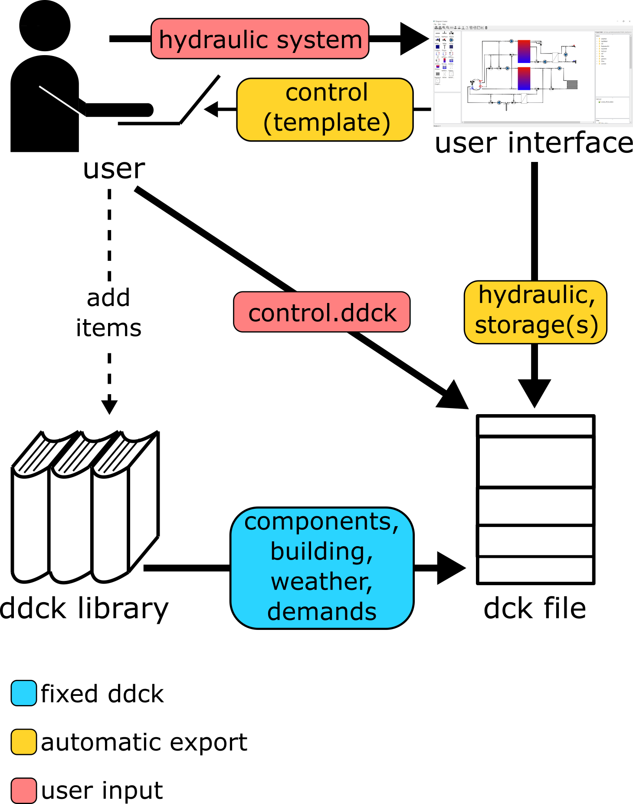

.. _building_dck:

Building a dck-file
===================

Modular ddck-files
------------------

.. note::
    This section only provides a short introduction to ddck-files. A more detailed description can be found in
    :ref:`the dedicated section <ddck_structure>`

One central aspect of pytrnsys is modularization. A TRNSYS simulation is fully defined by an often lengthy dck-file
containing all relevant information. Several UNITS of different and/or the same TYPES can be contained in such a file.
To make the creation of such a dck-file more flexible pytrnsys composes a dck-file from several modular files, which
were given the novel extension ``ddck``. Though there are a few special cases such ddck-file are typically corresponding
to one component in the system simulation, e.g. a heat pump. They are structured in the following manner:

    1. Name of the component
    2. Change log
    3. Description
    4. Inputs from hydraulic solver
    5. Outputs to hydraulic solver
    6. Outputs to energy balance
    7. Dependencies with other ddck-files
    8. TYPE declaration (PARAMETERS, INPUTS and OUTPUTS)
    9. Printer declaration(s)
    10. Online plotter declaration(s)

There are a few special ddck-files to which this outline does not apply. Those are described in the following section.

Composing a dck-file
--------------------

The modular ddck-files are stacked together to form a dck-file::

    head.ddck
    component_1.ddck
    component_2.ddck
    ...
    component_n.ddck
    hydraulic.ddck
    control.ddck
    end.ddck

Here the ``head.ddck`` contains the VERSION statement and a few global constants and the ``end.ddck`` simply contains
the END statement that each dck-file needs to include. Other special ddck-files that do represent a component of the
system to be simulated is the ``hydraulic.ddck`` and the ``control.ddck``. The former is based on type 935, which was
developed at SPF and contains the hydraulic information of the system, i.e. which component is connected which other
component and which pipes are used for that. The ``control.ddck`` specifies the position of valves in the system and the
mass flow rates of pumps. A template for this file can be exported from the graphical user interface. Note that
ddck-files that, e.g., specify the weather data are treated like system components.

Each standard ddck-file is connected to the hydraulics of the system through its inputs from and outputs to the
hydraulic solver. The inputs are the mass flow rates and temperatures of the pipes providing the hydraulic inputs to the
components, while the outputs are the respective outlet temperatures.

Workflow
--------

There are three sources for the ddck-files that make up a dck-file. The primary source is the ddck library that is
delivered with pytrnsys. It contains a wide array of system components like solar collectors or heat pumps and many
more. The second possible source is the user, who can also employ the graphical user interface either as the third
source of ddck-files or to generate templates of ddck-files.

ddck-files that are specific to each system can be directly exported from the graphical user interface. These are
the thermal storage tank(s) and the hydraulic information of the system. Furthermore, a template for the
``control.ddck`` can be exported from the graphical user interface, of which the details need to be filled by the
user directly. Finally, a user can also create any kind of ddck-file specific to their needs from scratch.