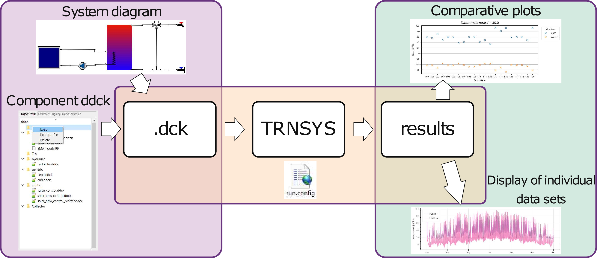

.. _getting-started:

Getting started
===============

Installation
------------

pytrnsys is best installed as part of its `graphical user interface  <https://github.com/SPF-OST/pytrnsys_gui/>`_ (see
also below). For a standalone installation of the pytrnsys python package, please follow the installation guide on
`GitHub <https://github.com/SPF-OST/pytrnsys/>`_.

Graphical user interface
------------------------

pytrnsys can be combined with a graphical user interface (GUI). This GUI is a separate package that includes pytrnsys
as a requirement. For further information on the GUI and on how to install it, please visit its
`GitHub page <https://github.com/SPF-OST/pytrnsys_gui/>`_.

Prerequesites
-------------

At the moment, TRNSYS 17 and TRNSYS 18 (32 bit) are supported. In order to use pytrnsys, you need to have TRNSYS
installed. Several original types are delivered with pytrnsys. For those you'll manually need to copy the dll-files
from::

    pytrnsys_data\ddcks\dlls

to the respective folder of your TRNSYS installation::

    ...\UserLib\ReleaseDLLs

Additional optional prerequisites are:
    - A working LaTeX distribution. We recommend MiKTex due to its included package management system.
    - Automated plotting is done by matplotlib. `GLE <http://glx.sourceforge.net/>`_  is needed to create Q-vs-T plots
      using the commands :ref:`plotHourlyQvsT <ref-plotHourlyQvsT>` or :ref:`plotTimestepQvsT <ref-plotTimestepQvsT>`
    - `GLE <http://glx.sourceforge.net/>`_ is also supported by the configuration file keyword
      :ref:`setPrintDataForGle <ref-setPrintDataForGle>` which exports a .gle file which can be used for further
      plotting in GLE.
    - `Inkscape <https://inkscape.org/>`_ can be used to save the plots in the enhanced meta file format by using the
      :ref:`plotEmf keyword <ref-plotEmf>` in the processing.

The philosophy of pytrnsys
--------------------------

When using TRNSYS to simulate systems, one arguably goes through three steps, which are all supported by pytrnsys. A
graphical user interface and a modular approach facilitate the creation of a dck-file, which defines the simulation.
Configuration files containing simple command lines support the user in specifying how they want to run the simulation
or do a parametric study. Finally, another type of configuration file allows to automatically do calculations on the
simulation results and generate plots.

One a more detailed level this means:

1. Building a dck-file, which defines the simulation
    - The idea is to use a modular approach stacking files with the extension \*.ddck together to form a single dck
      TRNSYS file.
    - The ddck files are structured in a way that they can be reused/modified easily to adpat to new cases. These
      files should be uploaded to GIT repositories if sharing/reusing is foreseen.
    - Our core idea to build a TRNSYS dck is to use a flow solver and an hydraulic ddck file which is custom to
      each case. A TRNSYS flow solver is a TYPE developed in house that gives the mass flow rates of all pipes and
      components given the mass flow rates of pumps and positons of 3-way controlled valves for each time step.
    - This hydraulic file also includes all TYPEs for the hydraulic elements such as pipes and tee-pieces. Thus,
      when connecting to all elements such as solar collectors the mass flow and temperature of the pipe that
      enters the collector which has a specific format name can be used directly. That is, connection between
      elements is very easy and can be done in a fully automatic way.
    - One of the functionalities of the `GUI  <https://github.com/SPF-OST/pytrnsys_gui/>`_ is to export the
      hydraulic setup such that it can be used directly with the flow solver. The hydraulic files you will find in
      the examples are exported from our GUI.
    - If you don't have the GUI you can still work with pytrnsys without any problem. However, you will need to
      know/connect the inputs (mass flow rates and temperatures) for each component like in normal TRNSYS. Our GUI
      and the flow solver make this almost fully automatic.
2. Running the desired simulation(s)
    - Once a TRNSYS dck has been generated with the method described above, by your own method or by Studio you
      can execute this dck with a lot of nice functionalities. For example you can easily run parametric studies
      in parallel and modifiy the dck file using a configuration file.
3. Post-processing the simulation results
    - Once the simulations are done you can easily process all results including several results from parametric
      studies using a config file where the main processing calculations can be done.
    - Some automatic processing is always done. For example the energy demand and the energy balance of the system
      is calculated automatically provided a proper syntax is used in the TRNSYS dck.
    - The custom-made processing can be easily added. To fully use our processing functionality you need a working
      LaTeX environment.
    - The processing functionality includes monthly and hourly calculations, files with results, and different
      types of automatic plots.
    - Basically all functionality we see is of use in general we add it into the config file. Other more project
      specific processing we do at python level. You will see how to do this at the developer's guide section.
    - Our method of processing TRNSYS simulations is based on our method to build a TRNSYS dck, so to fully use
      all functionalities you will need to change your own dck to have a similar structure as the one we have. For
      example the results are always stored in a temp subfolder and to do the automatic energy balance you need to
      provide the data with specific namings convention. However, still many functionalities can be theoretically
      done if you don't follow our method and style, but we never checked this, so you might find issues there.

This package is not intended to substitute your skills in TRNSYS, but if you have them it will make your life easier.
For those that don't know TRNSYS yet it will make the introduction easier, or at least this is our hope.