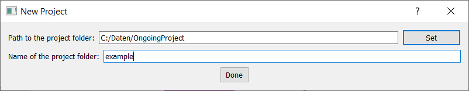
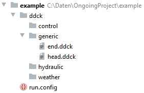
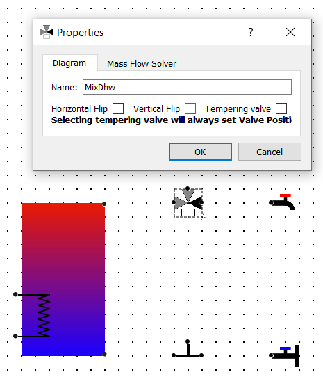
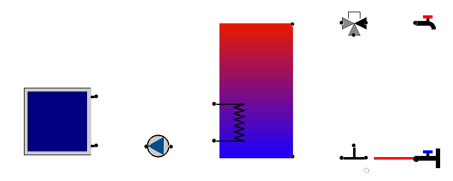
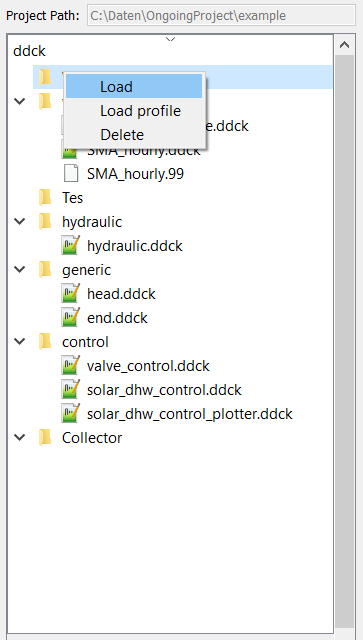

.. _gui:

The graphical user interface
============================

The user interface consists of a menu bar, a tool bar, and three widgets. The central and main widget of the interface
is the diagram. Here different components can be placed and connected. The available components can be found in the
widget on the lefthand side and can simply be dragged into the diagram to be placed. On the righthand widget the file
tree of the ``ddck``-folder can be seen. For each component dropped into the diagram an additional folder is created in
this tree.

.. image:: ./resources/interface.png
        :width: 100%
        :alt: interface

Components are simply added to a diagram by dragging the respective item from the library on the left into the central
widget. It is recommded to toggle the snap grid for placing components to ease the alignment of them:

Connections can be created by moving the cursor over a port, pressing the mouse, and dragging the cursor to the port
that is supposed to be connected, and release the mouse there. Each pipe has a technical flow direction along which the
mass flow rate is considered to be positive (and negative if it goes in the opposite direction). The technical flow
direction is indicated by a gradient going from a bright to a darker grey along the positive direction.

The menu and the tool bar
-------------------------

File
^^^^

``New`` Create a new project.

``Open`` Open an existing project.

    .. image:: ./resources/outbox.png
        :width: 50
        :alt: save

``Save`` Save the current diagram.

    .. image:: ./resources/inbox.png
        :width: 50
        :alt: save

``Copy to new folder`` Copy the complete content of the current project folder to a new one.

``Export as PDF`` Export the current diagram as a pdf.

``Debug Conn`` TBD

``Set TRNSYS path`` Set the path to the exe-file of the TRNSYS simulation from which you want to run the mass flow
solver.

Project
^^^^^^^

``Run mass flow solver`` Run a short TRNSYS simulation of the hydraulics of your system with the valve positions and
pump mass flow rates as given by the respective dialogues.

    .. image:: ./resources/runMfs.png
        :width: 50
        :alt: run mfs

``Start mass flow visualizer`` Visualize the mass flow rates and temperatures of the pipes of the hydraulic system.

    .. image:: ./resources/visMfs.png
        :width: 50
        :alt: visualize mfs

``Export hydraulic.ddck`` Export the ddck-file of the hydraulics of your system.

    .. image:: ./resources/exportHydraulics.png
        :width: 50
        :alt: export hydraulics

``Export hydraulic_control.ddck`` Export a template of the ddck-file specifying the control of your hydraulic system.

    .. image:: ./resources/exportHydraulicControl.png
        :width: 50
        :alt: export hydraulics

``Update run.config`` Update the configuration file for the execution of the simulation with the current project path
and the ddck-files included into the ddck-folder of your project.

    .. image:: ./resources/updateConfig.png
        :width: 50
        :alt: update run.config

``Export dck`` Export a dck file according to your configuration file, but do not launch the simulation.

    .. image:: ./resources/exportDck.png
        :width: 50
        :alt: export dck

``Run simulation...`` Run the simulation(s) as specified by the run.config-file.

    .. image:: ./resources/runSimulation.png
        :width: 50
        :alt: run simulation

``Process simulation...`` Post-process the results of your simulation as specified by the process.config-file.

    .. image:: ./resources/processSimulation.png
        :width: 50
        :alt: process simulation

``Export PlaceHolder JSON`` Export a JSON-file specifying each port's variable name for mass flow rate and 
temperature.

Edit
^^^^

``Toggle snap grid`` Toggle a grid to which the components can snap to ease placing them.

``Toggle align mode`` TBD

``Undo`` Undo the last edit.

``Redo`` Redo the last undone edit.

Remaining tool bar items
^^^^^^^^^^^^^^^^^^^^^^^^

``Zoom in`` Zoom into diagram.

    .. image:: ./resources/zoom-in.png
        :width: 50
        :alt: zoom in

``Zoom out`` Zoom out of diagram.

    .. image:: ./resources/zoom-out.png
        :width: 50
        :alt: zoom out

``Toggle labels`` Toggle the labels of the components and pipes.

    .. image:: ./resources/labelToggle.png
        :width: 50
        :alt: toggle labels

``Delete diagram`` Deletes the current diagram.

    .. image:: ./resources/trash.png
        :width: 50
        :alt: delete diagram

The file structure of a project
-------------------------------

The GUI expects a certain file structure for a directory representing a project. When a new project is initialized this
structure is automatically created and it needs to be there, when one wants to open a project with the GUI. In the
following the folder will be called ``[project name]``, where the square brackets indicate a placeholder for an actual
name. When the GUI is started the user is asked whether they want to create a new project or open an exisiting one. When
a new project is created a dialogue guides the user through the creation of a new project folder. Saving a diagram is
accomplished through the generation of a json-file inside ``[project name]``, that has the same name. This means that in
order to open the existing ``[project name]`` the following file needs to be opened::

    ..\[project name]\[project name].json

All files that need to be loaded for the project or which are generated from the GUI are saved in ``[project name]``.

When a project is initialized the following file structure is created:

The folder called ``ddck`` contains the folder ``generic``, into which the generic ddck-files ``head.ddck`` and
``end.ddck`` are loaded. Furthermore, the empty folders ``control``, ``hydraulic``, and ``weather`` are created. These
are folders for ddck-files that are not directly connected to any components in a project diagram. The project folder
also contains ``run.config``, which is a template that can be altered by the user.

Handling ddck-files
^^^^^^^^^^^^^^^^^^^

When dropping a component that is supposed to be represented by a ddck-file on the simualtion level, a folder is created
in the ddck-folder of the project that dynamically changes its name with the name of the component. All files that are
needed to represent the respective component when building a dck should be loaded into this component folder.

In the following different folders are described, which can be found in::

    ..\[project name]\ddck

Square brackets indicate place holders for component names.

``generic``

    This folder is created when a project is initialized and holds ``head.ddck`` and ``end.dck``, which contain the
    information that needs to be added at the beginning and the end of a dck-file respectively.

``[storage tank]``

    As soon as a storage tank is dropped in the diagram, a folder of the same name is created. Its name changes
    dynamically with the name of the storage tank. When the ddck-file of the storage tank is exported, it will build the
    following two files::

        ..\ddck\[storage tank]\[storage tank].ddck
        ..\ddck\[storage tank]\[storage tank].ddcx

    Here the file with the extension ``.ddck`` contains the information of the storage tank, that is needed to build the
    dck-file. Meanwhile, the file with the extension ``.ddcx`` contains the black box component temperature equations,
    which are needed to build ``hydraulic.ddck`` (see below).

``[component (not a storage tank)]``

    As soon as a component that requires one or more ddck-files for a simulation is dropped in the diagram, a folder of
    the same name is created. Its name changes dynamically with the name of the component. The user needs to load the
    ddck-file(s) that represent the component in question into the corresponding folder.

``hydraulic``

    This folder is created when a project is initialized. It is the default export destination for ``hydraulic.ddck``.

``control``

    This folder is created when a project is initialized. The user should load all ddck-files which represent control
    features into this folder. It is the default export destination for ``hydraulic_control.ddck``.

Complete procedure example
--------------------------

In the following the step by step procedure for starting with an empty diagram to launching a TRNSYS simulation is
presented. The full diagram of the demonstrated example looks like:

.. image:: ./resources/example_diagram.png
        :width: 100%
        :alt: interface

1. Initialize a project
^^^^^^^^^^^^^^^^^^^^^^^

When a new project is initialized the following dialogue is opened to build a folder for the project:

This creates the following file tree:

2. Build a diagram
^^^^^^^^^^^^^^^^^^

To make the placement of the components easier the snap grid is toggled.

(i) Set up storage tank
***********************

First, a storage tank is dropped in the diagram. This opens the following dialogue:

To make the diagram better arranged, the size of the storage is increased. Furthermore, its name is changed to ''Tes''.
Then a heat exchanger with its input at 40 % and its output at 10 % height of the storage tank on the left side is
added and named ''Tes_Hx'':

.. image:: ./resources/Tes_2.png
        :width: 70%
        :alt: Tes 2

Additionally, a pair of direct ports is added on the right side with the input at 1 % and its output at 99 % height of
the storage tank:

.. image:: ./resources/Tes_3.png
        :width: 70%
        :alt: Tes 3

(ii) Place components
*********************

Next, the components are placed one by one. They can be rotated when they are right-clicked, which is needed in the
current example for the pump.

Furthermore, when double-clicking components they can be re-named, which will also change the name of their respective
folder in the ddck-directory.

When a three-way valve is placed, the darker connector indicates the port through which there is always flow, when
there is flow at all. In our case this needs to be towards the warm water tap, since the three-way valve placed is
supposed to be the mixing valve for the warm water demand. To access the valve settings the component is simply
double-clicked. In the opened dialogue "vertical flip" is ticked for the correct orientation of the valve and
"tempering valve" to make it one.

(iii) Connect ports
*******************

After placing all components they can be connected. A connection is made from a port by holding the left mouse key and
dragging the cursor to another port, where the mouse is released.

The dialogue for a connection can be opened by right-clicking it.

3. Load ddck files
^^^^^^^^^^^^^^^^^^

Many components need to be represented by ddck- or other files in the simulation. These files need to be loaded to the
individual component folders in the ddck-directory. This is done by right-clicking the respective folder in the file
tree.

4. Export files and launch TRNSYS simulation
^^^^^^^^^^^^^^^^^^^^^^^^^^^^^^^^^^^^^^^^^^^^

Once the component files are loaded, different files needed for the simulation can be exported from the diagram.

(i) Export Tes.ddck
*******************

First, the ddck of the thermal storage tank needs to be exported. This is done by opening the storage tank dialogue by
double-clicking the component and then hitting the respective button on this dialogue.

(ii) Export hydraulic.ddck
**************************

Next, the ddck representing the hydraulics of the system needs to be exported. This is done by hitting the respective
button in the tool bar.

.. image:: ./resources/exportHydraulics.png
    :width: 50
    :alt: export hydraulic.ddck

(iii) Export DdckPlaceHolderValues.json
****************************

After that, the JSON-file consisting of the variable names for mass flow rate and temperature for each port needs to be 
exported. This is done by hitting the ``Export PlaceHolder JSON`` button under ``Project`` tool bar.

(iv) Export dck
****************

When all files needed are loaded and/or exported the dck-file (TRNSYS) can be built. Either this is done without
launching a simulation directly afterwards to just generate the file by pressing the respective button in the tool
bar

or a simulation is launched directly through hitting

